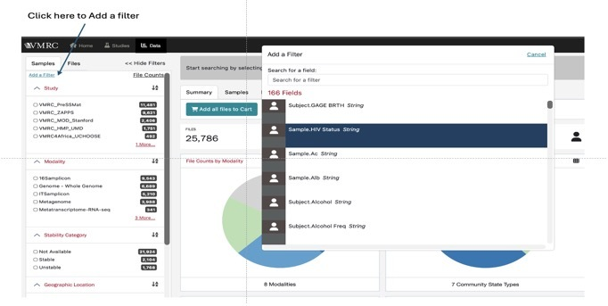

# The VMRC Portal

The VMRC Data Portal (https://portal.vmrc4health.org/) provides faceted search and advanced query tools to enable users to explore data in a more customized way.
The portal landing page is broken up into 3 sections:

*	The Welcome box provides your entry to querying data, described in more detail below.
*	A Bar graph breaks down number of samples per modality per study. 
*	The Data Portal Summary bar at the bottom provides a high level summary of all data currently available through the VMRC portal.

