# The VMRC Portal

## Overview 

The VMRC Data Portal (https://portal.vmrc4health.org/) provides faceted search and advanced query tools that enable users to explore data in a more flexible and customized way. The VMRC data portal currently hosts raw and processed data from 6 studies, which includes sequencing files, PacBio and Illumina assembly files, annotation files and analysis/processed files from 16Samplicon/ITSamplicon processing, metagenome, metatranscriptome, metabolome, immunology and metaproteome analyses.

The portal landing page is broken up into 3 sections:

*	The **Welcome box** provides your entry to querying data, described in more detail below.
*	A **Bar graph** breaks down number of samples per modality per study. 
*	The **Data Portal Summary bar** at the bottom provides a high level summary of all data currently available through the VMRC portal.  

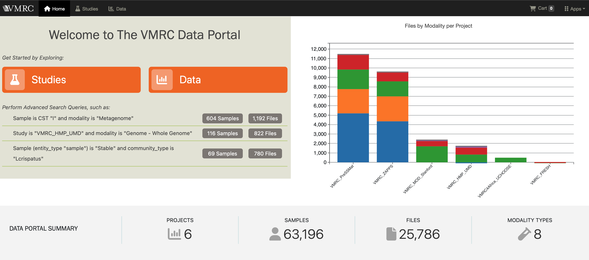

*
Fig. 1 : The VMRC portal landing page showing the Welcome box (left) , Bar graph breakdown of samples per modality and study (right) and the Data Portal Summary bar (bottom)
* 

## Welcome Box

Users can begin exploring data by study or through the faceted or advanced search options. The **Studies** button takes users to a summary page listing available studies, with links to all samples or all files associated with each study. The **Data** button takes users to the faceted data search page, the heart of the portal's functionality. 
Below these buttons is a set of pre-defined queries. For example, the second query can be used to easily retrieve all isolate genome data files associated with VMRC_HMP_UMD study. 

## Studies Page

The **Studies** page lists all available studies along with counts of associated samples and files, including both raw and processed files (Fig. 2). Clicking on the files or samples associated with a particular study allows users to work with that subset of data. Links to abundance matrix files are also available for each study, enabling direct access. 

Files in the portal belong to two data categories:

* **Primary** : Raw sequencing files, assembly files, annotation files 
* **Summary** : Analysis files such as Abundance matrices, KEGG Taxonomy, Report files etc. 

The contact Principal Investigator (PI) for each study is also displayed on this page. Users can customize the displayed columns using the hamburger   icon in the upper right corner.  

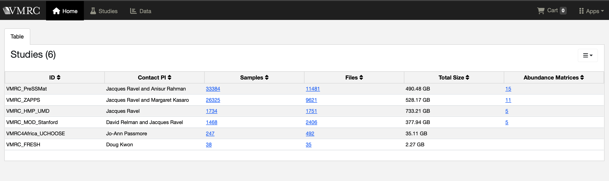

*
Fig. 2 : Summary page of available studies with links to associated samples and files
*  

## Faceted Data Search Page

The VMRC Data Portal provides a simple faceted search query interface to help users identify the data of interest. A complete list of all available facets in the portal, along with their descriptions, is provided in the *keyword descriptions document* linked [here](resources/portal/keywords.tsv). The faceted search page (*Fig. 3*), accessible through the **Data** button in the landing page welcome box, is divided into 3 sections (*Fig.4*): 

* **Faceted Search box**
* **Advanced Search box** 
* **Summary Results Panel**    

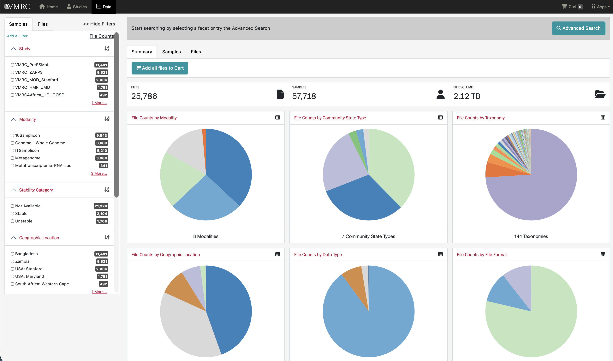

*
Fig. 3: Faceted Search page accessible through the Data button of the landing page
* 

The *Faceted Search box* on the left is a filter panel that allows users to select one or more of the available facets to narrow down the samples of interest (*See #1 in Fig. 4*). Selecting any facet automatically populates the *Advanced Search box* with the current query (*See #2 in Fig. 4*). The *Summary Results Panel* provides dynamic pie charts summarizing data corresponding to the currently selected filters (*See #3 in Fig. 4*).  

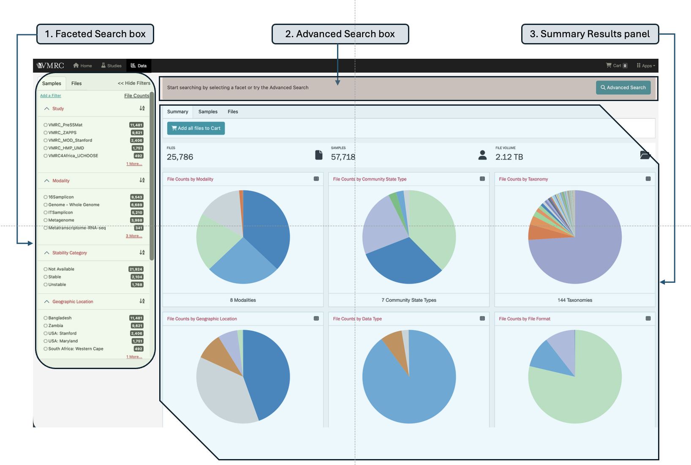

*
Fig. 4 : Screenshot of the Faceted Data Search page showing the 1) Faceted search box, 2) Advanced search box and 3) Summary results panel
*  

### Faceted Search Box

The faceted search box contains two tabs of pre-configured facets associated with
* **Samples** (study, modality, stability category, geographic location, host age group, pregnancy status and entity type), or
* **Files** (data category, data type, file format, data access)   

#### Adding Filters to the Faceted Search box:

Additional facets can be added to the Faceted Search box using *Add a Filter* in the upper left of the faceted search panel. The resulting pop-up lists all additional searchable facets available, which can be browsed or searched for using the search bar at the top. Clicking on any facet will add it to the top of the filter panel for incorporation into the current filter.   

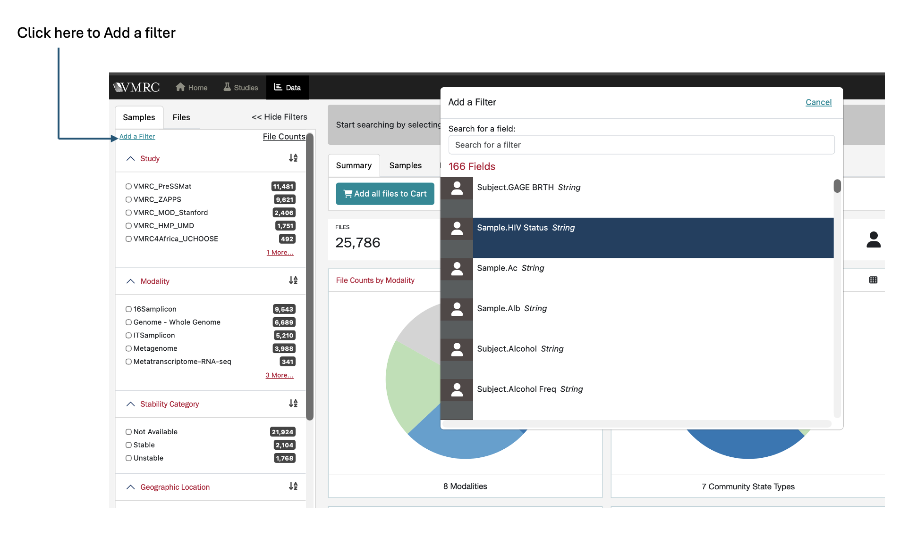

*
Fig. 5: Adding filters to the Faceted search box. A pop up appears where you can search for available file, sample, subject and study-specific facets
* 

Figure 5 illustrates how to add a filter and search for available facets using the search bar that pops up.  Note that **HIV Status** is not listed as a default facet under **Samples** tab in the faceted search panel. However, when you add **HIV Status** as a filter, it appears under **Samples** in the faceted search panel, as you can see in the figure below (*Fig. 6*). 

Users can search for and add additional filters that are file-, sample-, subject- or study-specific. All study-specific facets can be searched for by typing *study* in the *Add a filter* search box. Similarly,  file-, sample- and subject-specific facets can be searched and added. Detailed descriptions of all available search facets are provided in the [keyword descriptions document](resources/portal/keywords.tsv). All study-, sample- and subject-level facets that are added will appear under the **Samples** tab in the faceted search panel, while file-specific facets will appear under the **Files** tab. 

To remove filters, you can either click **Remove Added Filters** to clear all added filters or remove individual filters by clicking the red **X** next to the corresponding filter. Added filters will persist between sessions until you remove them.

Next to each filter, the alphabet (**AZ**) icon allows you to sort the filter terms in ascending or descending order. This is especially helpful when working with long lists of search terms, such as sample taxonomy for isolate genomes.   

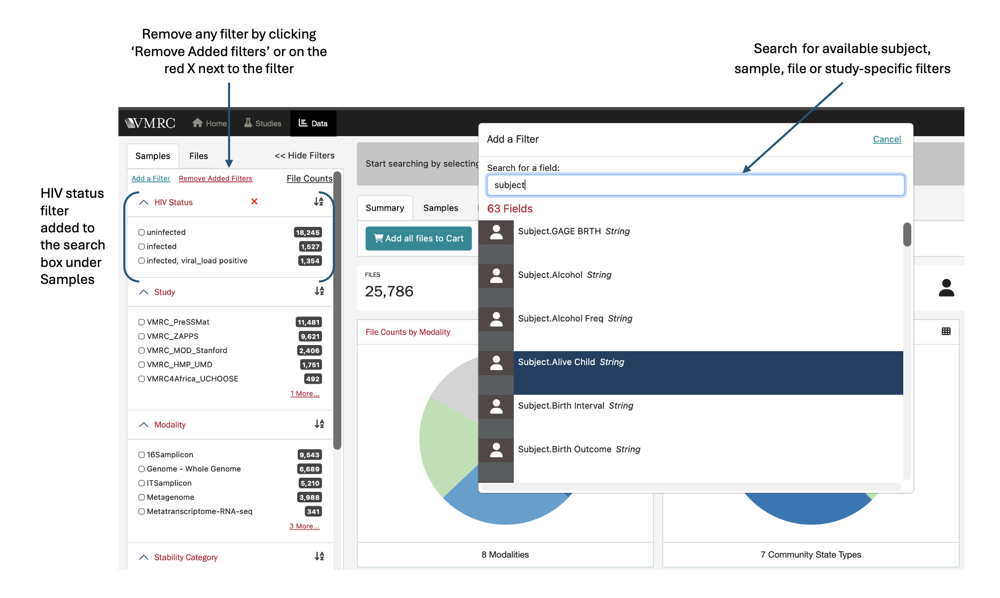

*
Fig. 6: Screenshot illustrating how an added filter (HIV Status) appears in the Faceted search box,how to remove added filters and how to search for available search facets
*  

### Summary Results Panel

The results from the faceted search box and additional filters are organized into three views - **Summary**, **Samples** and **Files**. 

Under the **Summary** tab, results are displayed as pie charts showing file counts by modality, community state type, taxonomy, geographic location, data type and file format. 

The number displayed next to each facet in the faceted search panel corresponds to the total number of samples associated with this attribute across all projects in the portal. This number does not change dynamically as facets are selected or deselected. What does change is the summary results panel. As facets are selected, the file count, sample count and total file volume will update to reflect the current filter(s). The pie charts also update accordingly. 

Hovering over a pie chart displays count information for each component. Each summary pie chart also includes a table icon in the upper right corner. Selecting this icon switches the view to a table showing counts of files and total file size for each component, allowing users to toggle between chart and table views.  

  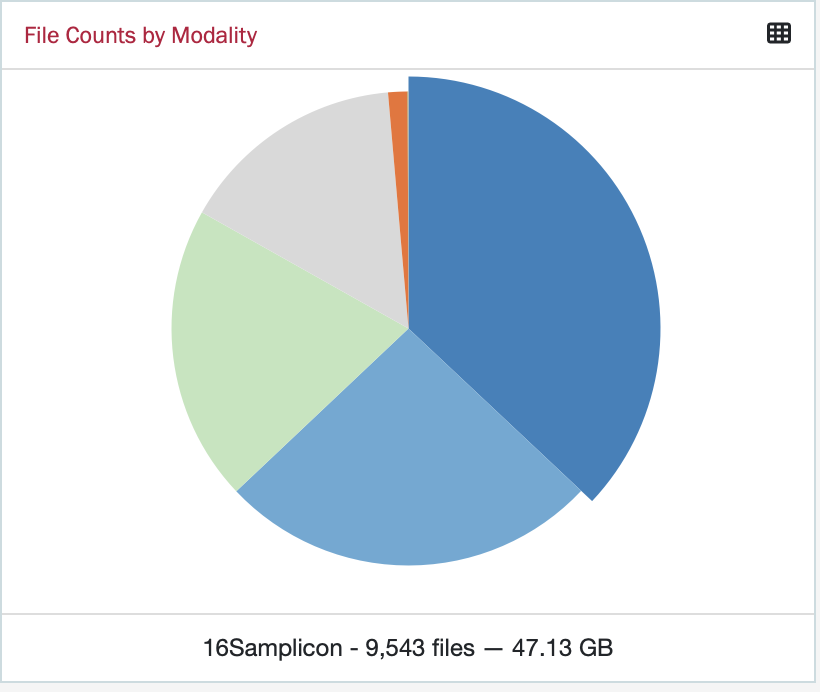
  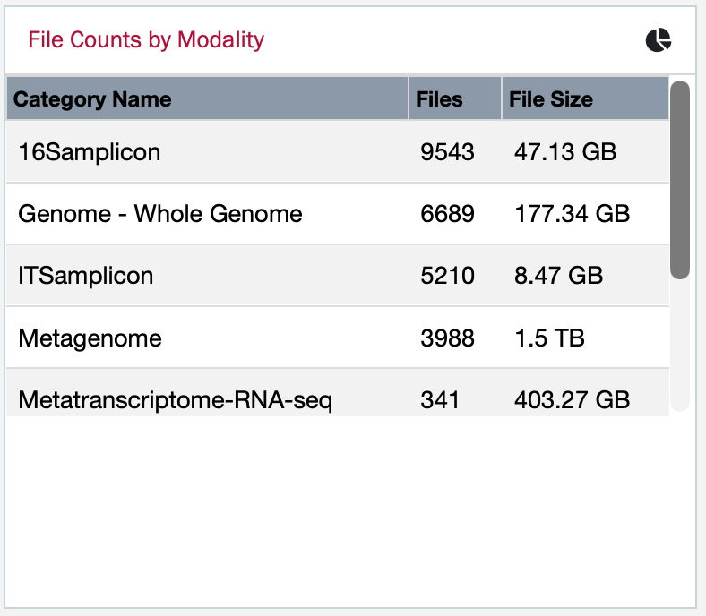

*
Fig.7: Screenshot of the Pie chart (left) representing File Counts by Modality, with the 16Samplicon component selected. The table view (right) lists file counts and total file volume, by modality
* 

The **Samples** tab in the Summary results panel lists all the samples associated with the query. By default, the displayed columns include study, subject, entity type, taxonomy and community state type.  Users can customize the displayed columns using the hamburger icon in the upper right corner. 

Similarly, the **Files** tab lists files that match the search query, along with details such as file format, data type, file size, data access status (open or restricted), and the contact PI’s name, for obtaining additional information, especially regarding restricted data.   

#### Example Queries: 

**A.	Retrieve all abundance matrix files from 16samplicon processing of VMRC_PreSSMat samples**

1.	Click the **Data** button in the welcome box to access the faceted search page
2.	In the **Samples** tab of the faceted search box, select:
    * ‘VMRC_PreSSMat’ under **Study** and 
    * ‘16Samplicon’ under **Modality**
3.	Switch to the Files tab of the faceted search box and select:
    * ‘summary’ as **Data Category** and 
    * ‘Abundance matrix’ as **Data Type** 

The **Summary** tab of the Summary  Results panel will update the pie charts according to the search results. The **Files** tab in the Summary results panel will list all the 16Samplicon abundance matrix files as shown in the Fig. 8. The corresponding Advanced search query is automatically populated in the Advanced search box, as you make selections (also illustrated in Fig. 8).  

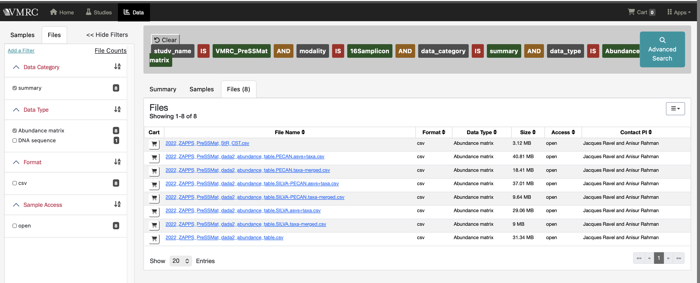

*
Fig. 8 : Screenshot of the files tab of the Summary results panel listing the 16Samplicon Abundance matrix files from VMRC_PreSSMat study samples
* 

**B.	Retrieve all Lactobacillus iners isolate genome FASTA files from pregnant women in Zambia who delivered pre-term**

1.	Click the **Data** button in the welcome box to access the faceted search page
2.	In the **Samples** tab of the faceted search box, select:
    * ‘Zambia’ under **Geographic Location**, 
    * ‘pregnant’ under **Pregnancy Status** and 
    * ‘Genome – Whole Genome’ under **Modality**
3.	Click **Add a Filter** and add the **SPTB/Preterm** and **Samp Taxonomy** filters to the search facets
    * Choose ‘yes(<37 wks)’ under **SPTB/Preterm** and 
    * Use the alphabetic sort button next to **Samp Taxonomy** and pick ‘Lactobacillus iners’
4.	In the **Files** tab of the faceted search box, choose ‘fasta’ under **Format**   

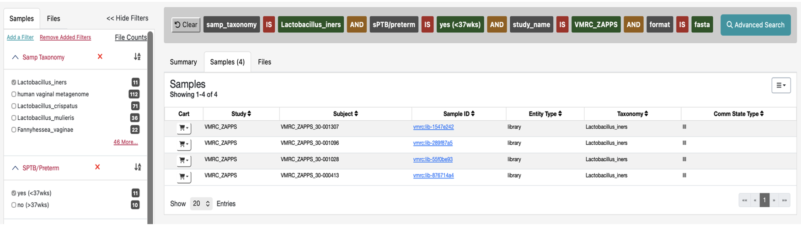

*
Fig. 9 : Screenshot of the **Samples** tab of the summary results panel displaying only Lactobacillus iners isolate genome samples from pregnant women in Zambia, who delivered pre-term
*   

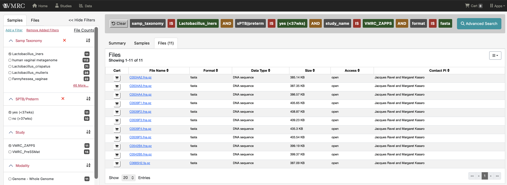

*
Fig. 10: Screenshot of the **Files** tab of the summary results panel displaying only fasta files from Lactobacillus iners isolate genome samples from pregnant women in Zambia, who delivered pre-term
*  

### Advanced Search Box

The Advanced Search feature simulates querying a database directly. To begin an advanced search, click the "Advanced Search" button in the upper right corner of the advanced search box.   

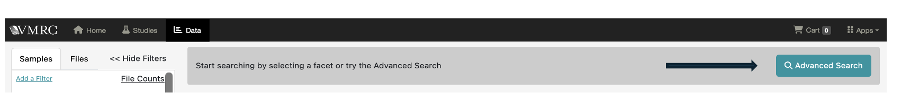

*
Fig. 11: Screenshot of Advanced Search box in the Faceted Data Search page
* 

A query requires the following basic format:

(property) (comparison operator) (value)

The property is the facet that you're searching on. Beginning to type a facet will bring up a list of allowable terms. The comparison operator is how you want to relate your value to your property. The value is what you're filtering the property on. 

Accepted comparison operators are: = (equals), != (not equals), NOT, IS, IN and EXCLUDE.

For example, to retrieve only isolate genome FASTA files from VMRC_ZAPPS study, you can enter the following query:

*     study.project_name = "VMRC_ZAPPS" AND sample.modality = "Genome - Whole Genome" AND file.format = “fasta” 

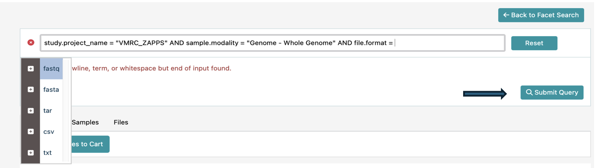

*
Fig. 12: Screenshot of the advanced search query showing the auto-complete feature for available file formats
* 

The auto-complete feature helps in entering an advanced query. It pulls all valid options directly from the database to ensure that the user's search contains a valid property, comparison operator, and value. If auto-complete suggests no results in your query, you know that you have entered nonexistent combinations of property+comparison operator+value. The auto-complete feature is also helpful in that it allows users to browse all current values in the database for that particular property. In Figure 12 the options for *file format* pops up as part of this auto-complete feature.

Clicking "Submit Query" will update the summary results panel in the same way as the faceted search.  

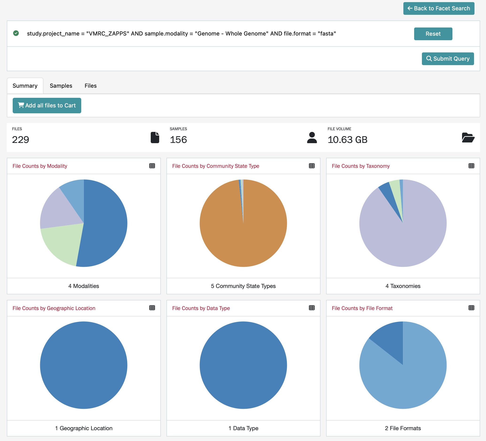

*
Fig. 13: Screenshot of the Summary results panel displaying the outcome of advanced search query for isolate genome FASTA files from the VMRC_ZAPPS study
*  

## Adding Files to the Cart

Once the data has been refined to the dataset of interest, click on the **Files** tab in the summary results panel, to view all files matching the search criteria. To download files, users can either click on the cart icon to the left of individual files of interest OR add all files resulting from the query to the cart by clicking on *Add all files to cart* button under the **Summary** tab. 

Fig. 14 shows a screenshot in which two files have been added to the cart, with their cart icons highlighted in green.   

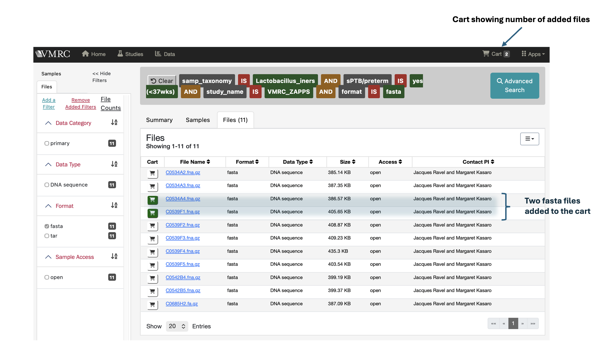

*
Fig. 14 : Screenshot showing the addition of selected files to the cart
* 

Clicking on an individual file takes users to a summary page for the selected file (*Fig. 15*). This summary page provides details such as the filename, associated sample and study, file URL in Google Cloud storage bucket, file size, MD5 checksum, modality and data type. Users can add the selected file to the cart directly from this page by clicking on the cart icon. In Fig. 15, the green-colored cart icon indicates that the file is already in the cart. The **Cart** icon in the upper-right corner of the page displays the number of items currently in the cart.   

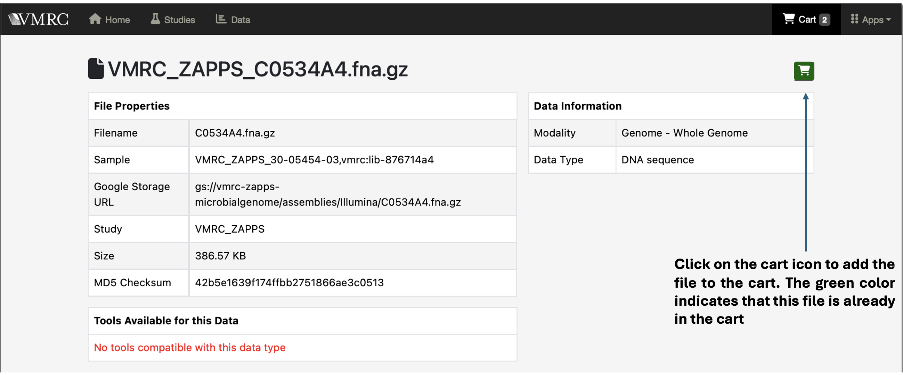

*
Fig. 15: Screenshot of the file summary page.The selected file can be added to the cart directly from this page
* 

Users can continue to browse for additional files, combine results from multiple queries, or proceed to the cart page to download the selected files. Clicking on the Cart icon opens the cart page, which lists all selected files and provides additional details such as file format, modality and total file volume (*Fig. 16*).

Individual files can be removed from the cart by clicking on the trash icon to the left of each file, or all files can be removed at once by clicking the *Remove from Cart* button.

Users can download the **File Manifest** and **Sample Metadata** using the **Download** button. Downloading and analyzing large files can be very resource intensive and hence it is recommended to use the **Portal Client** for downloading files. In order to download files using the portal client, a **File Manifest** is required, which includes file ID, MD5 checksum, file size, file URL and the associated sample id. Instructions for using the portal client to download files with a file manifest, are available on the [Github](https://github.com/IGS/portal_client) page,  which can also be accessed via the **Data Transfer** link under the **Apps** button in the upper-right corner of the portal page (*Fig. 17*).   

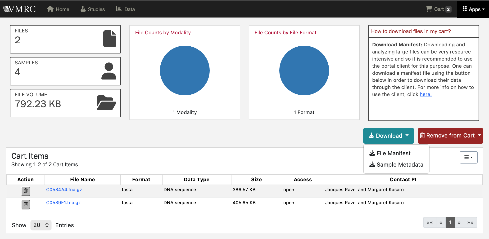

*
Fig. 16: Screenshot of the Cart page showing the files in the cart, the Download button for downloading File manifest and Sample metadata and the Remove from cart button for removing file
*  

## Quick Access to Documentation and other important links

On the VMRC Data portal home page, there is an **Apps** button located at the upper-right corner, next to the Cart icon. Clicking the Apps button opens a dropdown menu that provides quick access to important webpages and resources including:

* **Data Portal** takes users to the VMRC data portal home page
* **Website** links to the official VMRC Website
* **Documentation** links to the VMRC Portal README file
* The **Data Transfer** links to the IGS portal client GitHub page, which provides guidance on downloading files using the portal client.  

  
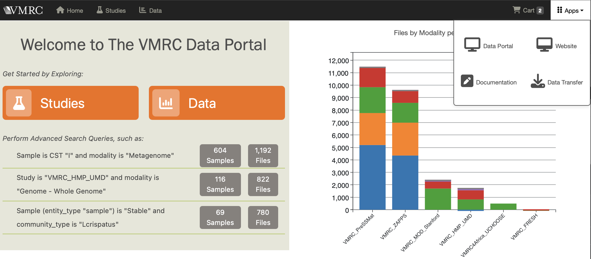

*
Fig. 17 : Screenshot of the links accessible through the Apps button on the VMRC portal home page
* 

